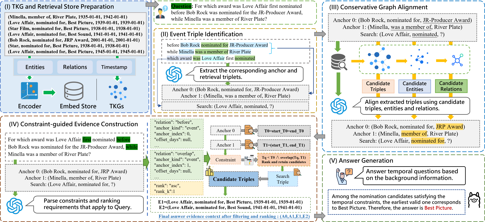

# SCoP

> 🎉 Our paper has been accepted by CIKM 2026!

**SCoP: Structured Constraint Parsing for Evidence-Space Control in Temporal Knowledge Graph Question Answering**

This repository contains the implementation used in the SCoP paper. SCoP answers temporal knowledge graph questions by constructing a structurally and temporally admissible evidence space before final answer generation.



Supported datasets:

- `MultiTQ`
- `TimelineCronQR` in code, corresponding to **TimelineCronQ-R** in the paper

> **TimelineCronQ-R Reconstruction Detail and Summary**： [TimelineCronQ-R Reconstruction](./TimelineCronQ-R_repair_code/README.md)

## Environment Setup

We recommend the following environment:

- Python 3.11
- Pytorch 2.6.0+cu124
- CUDA 12.4

```bash
conda create -n scop python=3.11 -y
conda activate scop
pip install -r requirements.txt
```

## 1. Repository Structure

```text
SCoP/
├── scop_main.py
├── timeline_baseline.py
├── run_scop.sh
├── run_timeline_baselines.sh
├── config.env
└── src/
    ├── scop.py
    ├── constraint.py
    ├── co_retriver.py
    ├── llm/
    ├── eval/
    ├── utils/
    └── config/
```

| Path                          | Description                                                                 |
| ----------------------------- | --------------------------------------------------------------------------- |
| `scop_main.py`              | Main entry point for SCoP                                                   |
| `timeline_baseline.py`      | Entry point for TimelineCronQ-R baseline experiments                        |
| `run_scop.sh`               | Shell script for running SCoP and ablation experiments                      |
| `run_timeline_baselines.sh` | Shell script for TimelineCronQ-R baseline experiments                       |
| `src/scop.py`               | Main SCoP pipeline                                                          |
| `src/constraint.py`         | Temporal constraint parsing and execution                                   |
| `src/co_retriver.py`        | Triple retrieval, alignment-related orchestration, and evidence preparation |
| `src/llm/`                  | LLM prompts, few-shots and structured parsing modules                       |
| `src/eval/`                 | Evaluation scripts for Hits@k and evidence-space analysis                   |
| `src/utils/`                | Graph construction, FAISS indexing, and utility functions                   |
| `src/config/`               | Configuration loading and model/runtime settings                            |

## 2. Environment Setup

Runtime settings are read from `config.env`:

```bash
CHAT_MODEL=
OPENAI_BASE_URL=
OPENAI_API_KEY=

TEMPERATURE=0.0
TIMEOUT=30
MAX_TOKENS=8192

EMBED_MODEL_PATH=
EMBED_BATCH_SIZE=64
CUDA_DEVICE=cuda:0

DATASET_DIR=./data/datasets
BASE_STORE_DIR=./data/build_store
EXPERIMENT_OUTPUT_DIR=./test_run_results
```

Required items are the chat model endpoint, API key, local embedding model path, dataset directory, artifact directory, and output directory.
The embedding model is loaded with `local_files_only=True`; therefore `EMBED_MODEL_PATH` must point to a locally available SentenceTransformer-compatible model.

---

## 3. Dataset Layout

```text
DATASET_DIR/
├── MultiTQ/
│   ├── kg/full.txt
│   └── questions/test.json
└── TimelineCronQR/
    ├── kg/full.txt
    └── questions/test.json
```

`kg/full.txt` supports either point facts:

```text
subject<TAB>relation<TAB>object<TAB>yyyy-mm-dd
```

or interval facts:

```text
subject<TAB>relation<TAB>object<TAB>start_time<TAB>end_time
```

---

## 4. Script Examples

### MultiTQ

```bash
DATASET=MultiTQ \
TEST_SIZE=54584 \
ABLATION_TYPES="full" \
bash run_scop.sh
```

### TimelineCronQ-R / `TimelineCronQR`

```bash
DATASET=TimelineCronQR \
TEST_SIZE=2080 \
ABLATION_TYPES="full" \
bash run_scop.sh
```

The first run automatically builds the temporal graph and FAISS retrieval artifacts under:

```text
BASE_STORE_DIR/<DATASET>/
```

---

## 5. Ablation Studies

Supported ablation modes:

```text
full
no_triple
no_align
no_constraint
```

### MultiTQ

```bash
DATASET=MultiTQ \
TEST_SIZE=54584 \
ABLATION_TYPES="full no_triple no_align no_constraint" \
bash run_scop.sh
```

### TimelineCronQR

```bash
DATASET=TimelineCronQR \
TEST_SIZE=2080 \
ABLATION_TYPES="full no_triple no_align no_constraint" \
bash run_scop.sh
```

---

## 6. TimelineCronQR Baselines

The controlled baseline setting in the paper uses:

- final evidence budget: `20`
- pre-filter retrieval budget: `50`
- max iterative retrieval steps: `5`

```bash
TEST_SIZE=2080 \
FINAL_K=20 \
FILTER_RETRIEVE_K=50 \
MAX_STEPS=5 \
bash run_timeline_baselines.sh
```

Supported modes:

```text
rag
rag_filter
hyde_rag
hyde_rag_filter
query2doc_rag
query2doc_rag_filter
react
react_filter
ircot
ircot_filter
```

To run only selected baselines:

```bash
MODE_LIST="rag rag_filter react react_filter" bash run_timeline_baselines.sh
```

---

## 7. Outputs and Paper-Result Mapping

SCoP outputs are written to:

```text
EXPERIMENT_OUTPUT_DIR/ablation/<DATASET>/<MODEL>/<ABLATION_TYPE>/test_<N>/run_<ID>/
```

Key files include:

```text
q_decomposed.json
aligned_decomposed.json
constrained.json
answer_file.json
```

Baseline outputs are written to:

```text
EXPERIMENT_OUTPUT_DIR/corn_baseline/
```

Evaluation is triggered automatically after SCoP runs. The code reports Hits@1 / Hits@10 and also performs evidence-space analysis from constrained outputs.
